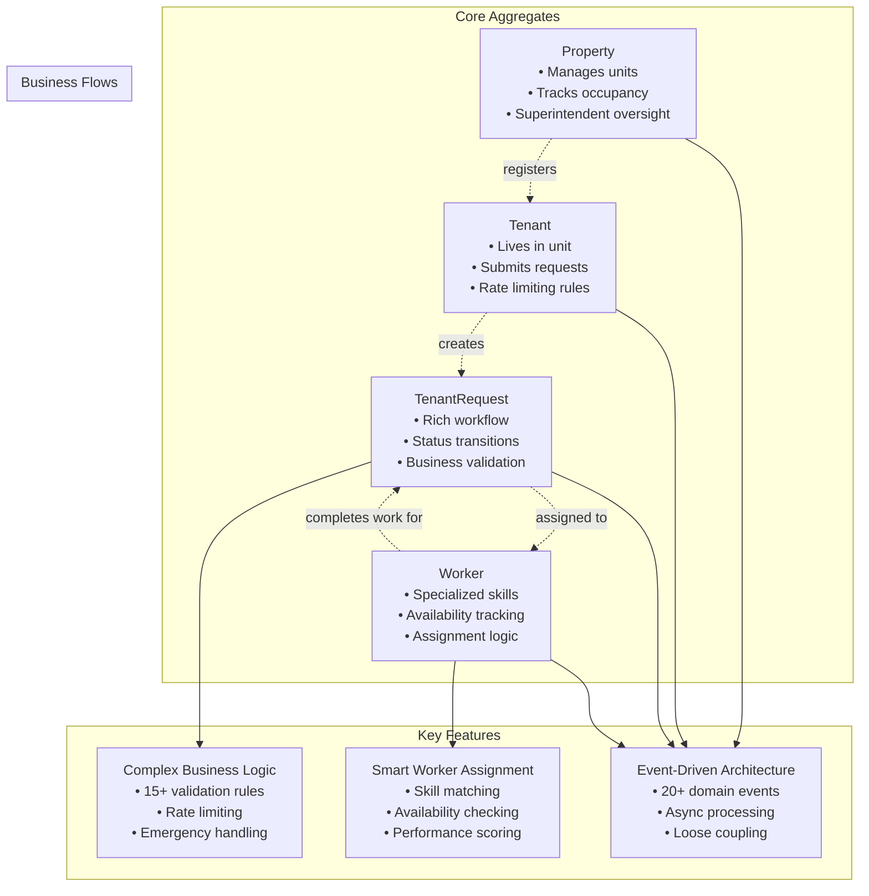
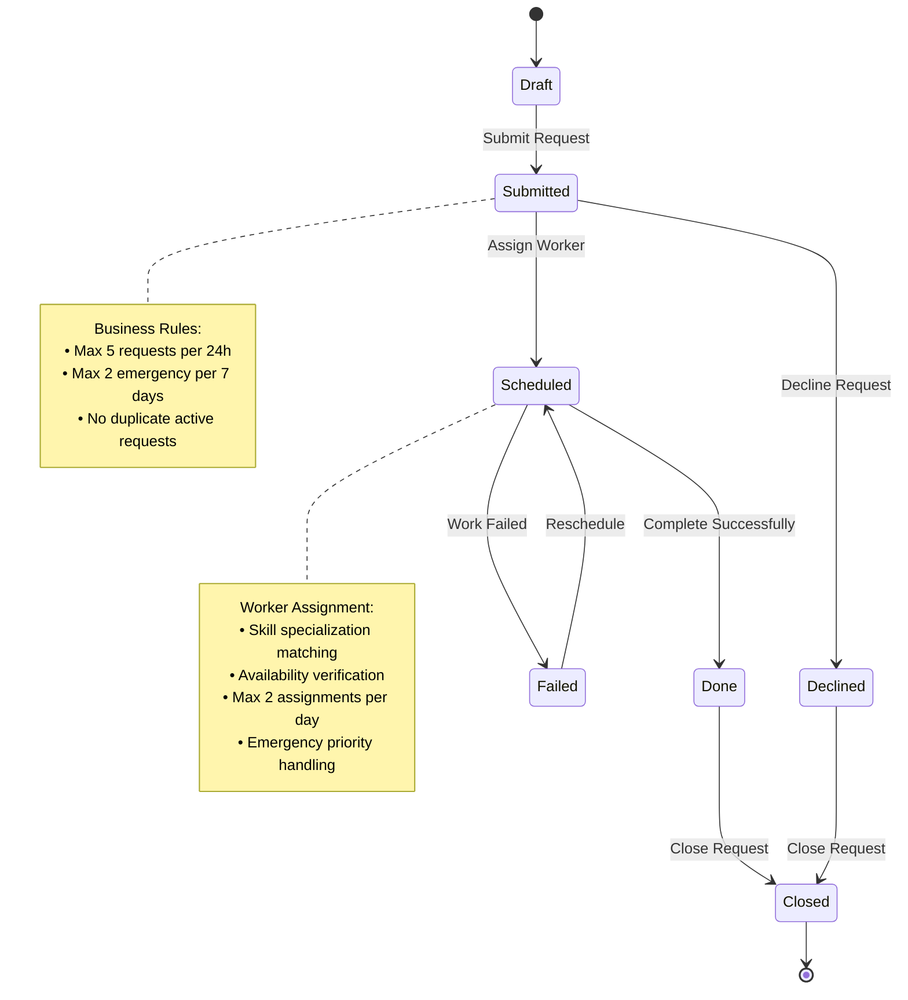

# RentalRepairs - Building Workflow Applications for Multi-User Scenarios with Clean Architecture and DDD

A practical exploration of designing workflow-driven, multi-user applications using Clean Architecture, Domain-Driven Design (DDD), and modern .NET 8 technologies.
## Architecture Overview

This project showcases modern software architecture patterns:

- **Clean Architecture** with proper dependency inversion
- **Domain-Driven Design** with rich domain models
- **CQRS** (Command Query Responsibility Segregation) with MediatR
- **Repository Pattern** for data access abstraction
- **Specification Pattern** for complex queries
- **Domain Events** for cross-cutting concerns

## Advanced Domain Architecture

This project demonstrates advanced **Domain-Driven Design** with a complex business domain:



### Domain Complexity Highlights

- **4 Core Aggregates** with sophisticated business logic encapsulation
- **15+ Value Objects** ensuring data integrity and business rule enforcement
- **20+ Domain Events** enabling loose coupling and async workflows
- **Complex Business Rules**: Rate limiting, emergency prioritization, worker-request matching
- **Rich Status Workflows** with validation at each transition

## Technology Stack

- **.NET 8** - Latest .NET framework
- **ASP.NET Core Razor Pages** - Server-side rendering
- **Entity Framework Core** - ORM with SQL Server
- **MediatR** - CQRS implementation
- **Mapster** - Object-to-object mapping
- **FluentValidation** - Input validation
- **xUnit** - Comprehensive testing framework

## Project Structure

```
src/
├── Domain/              # Pure business logic (no dependencies)
├── Application/         # Use cases and application logic  
├── Infrastructure/      # External concerns (database, email, etc.)
├── WebUI/              # Razor Pages presentation layer
├── CompositionRoot/    # Dependency injection configuration
└── *.Tests/           # Comprehensive test coverage
```

## Key Features Demonstrated

### Domain Layer
- Rich domain entities with encapsulated business logic
- Value objects for data integrity
- Domain events for decoupled communication
- Specification pattern for complex queries
- Domain services for cross-aggregate operations

### Application Layer  
- CQRS with 45+ command and query handlers
- Application services for workflow orchestration
- DTOs with proper mapping strategies
- Comprehensive validation pipeline
- Clean separation of read/write operations

### Infrastructure Layer
- Repository pattern implementations
- Entity Framework configurations
- Authentication and authorization
- External service integrations
- Caching and performance optimizations

### Presentation Layer
- Clean Razor Pages with proper separation
- View models and mapping
- Role-based authentication
- Responsive design with Bootstrap 5

## Getting Started

### Prerequisites
- .NET 8 SDK
- SQL Server LocalDB (or SQL Server)
- Visual Studio 2022 or VS Code

### Quick Start
```bash
# Clone the repository
git clone https://github.com/akhmelevtsov/RentalRepairs.CleanArchitecture.git
cd RentalRepairs

# Restore packages
dotnet restore

# Run the application
dotnet run --project src/WebUI/

# Access the application
https://localhost:5001
```

### Demo Credentials
The application includes demo authentication:
- **Admin**: admin@demo.com / Demo123!
- **Tenant**: tenant1.unit101@sunset.com / Demo123!  
- **Worker**: plumber.smith@workers.com / Demo123!

## Testing

```bash
# Run all tests
dotnet test

# Run with coverage
dotnet test --collect:"XPlat Code Coverage"
```

## Documentation

- **[Simple Demo Guide](docs/simple-demo-guide.md)** - **Quick 4-step workflow demonstration** showing core functionality
- **[Complete Domain Model Diagrams](docs/domain-model-diagrams.md)** - Comprehensive technical documentation with 10+ detailed Mermaid diagrams
- **[Architecture Highlights](docs/architecture-highlights.md)** - Portfolio-focused architectural overview
- **[Business Rules Documentation](docs/business-rules.md)** - Detailed business logic and validation rules
- **[Getting Started Guide](docs/GETTING_STARTED.md)** - Development setup and deployment
- **[Development Setup](docs/DEVELOPMENT_SETUP.md)** - Local development configuration

## Clean Architecture Benefits Demonstrated

1. **Testability**: High test coverage with isolated unit tests
2. **Maintainability**: Clear separation of concerns
3. **Flexibility**: Easy to change external dependencies
4. **Scalability**: CQRS pattern supports read/write optimization
5. **Domain Focus**: Business logic is framework-independent

## Developer Experience

This project demonstrates:
- Proper dependency injection configuration
- Comprehensive error handling
- Logging and monitoring setup
- Security best practices
- Performance optimization techniques

## Business Domain

This application models a **rental property maintenance system** with sophisticated business workflows:

### Core Business Entities



### Business Workflows
- **Tenant Request Lifecycle**: From submission through completion with rich validation
- **Worker Assignment Logic**: Intelligent matching based on skills, availability, and workload
- **Emergency Handling**: Priority routing and specialized response protocols
- **Multi-Role Notifications**: Automated communication to all stakeholders

## Architecture Highlights

### Clean Architecture Layers
- **Domain Layer**: Contains business entities, value objects, domain services, and business rules
- **Application Layer**: Implements use cases using CQRS pattern with command and query handlers
- **Infrastructure Layer**: Handles data persistence, external services, and cross-cutting concerns
- **Presentation Layer**: Razor Pages with proper separation of concerns and responsive design

### Domain-Driven Design Patterns
- **Aggregates**: `Property`, `Tenant`, `Worker`, `TenantRequest` with proper boundaries
- **Value Objects**: `PropertyAddress`, `PersonContactInfo`, `SchedulingSlot`
- **Domain Events**: For decoupled communication between aggregates
- **Specifications**: For complex query logic encapsulation

### CQRS Implementation
- **Commands**: Write operations with business validation
- **Queries**: Read operations optimized for specific use cases
- **Handlers**: Separate handlers for each command and query
- **DTOs**: Proper data transfer objects for each layer

## License

This project is licensed under the MIT License - see the [LICENSE](LICENSE) file for details.

**Copyright (c) 2025 Protva Software Inc**

