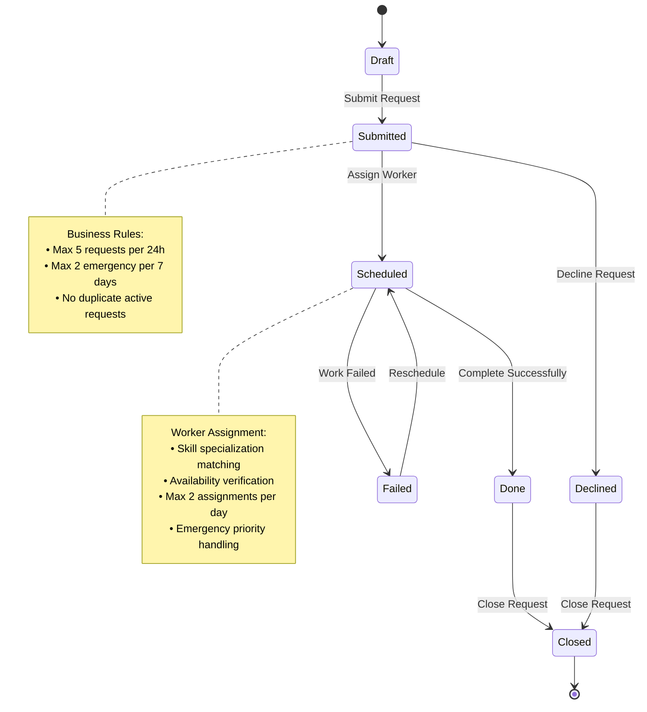
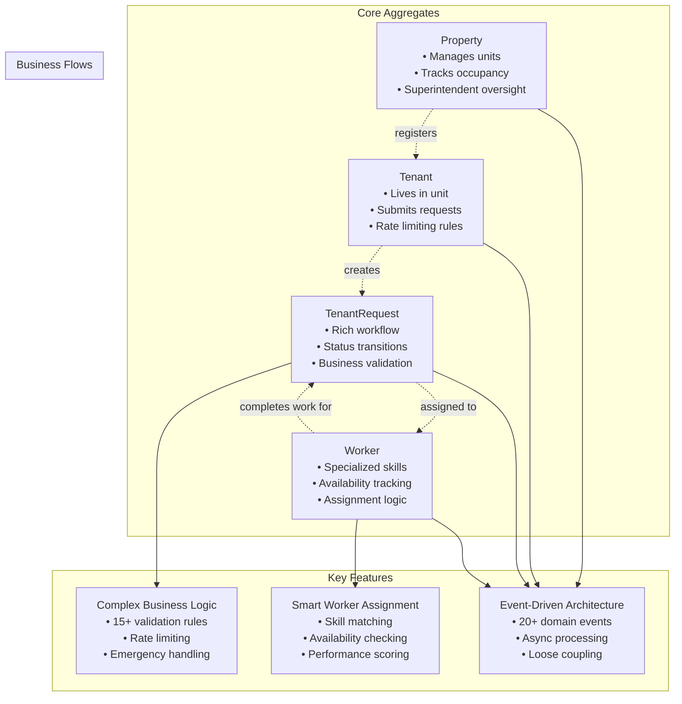
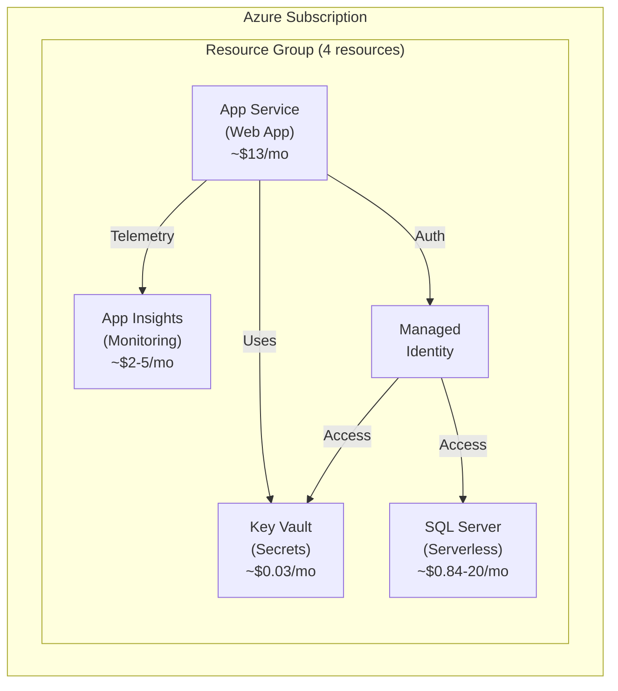

# RentalRepairs - Building Workflow Applications for Multi-User Scenarios with Clean Architecture and DDD

A practical exploration of designing workflow-driven, multi-user applications using Clean Architecture, Domain-Driven Design (DDD), and modern .NET 8 technologies.

## Project Overview

This is a reference implementation demonstrating production-ready architectural patterns for building complex business applications. It showcases Clean Architecture, Domain-Driven Design, and CQRS patterns applied to a real-world rental property maintenance workflow system.

**Project Status:** Active development - suitable for learning, reference, and portfolio demonstration.

## Live Demo

**[View Live Demo](https://rentalrepairs-dev-app.azurewebsites.net/)**

> **Note:** The demo runs on cost-optimized Azure infrastructure with serverless SQL. Initial load may take 20-30 seconds if the database has auto-paused due to inactivity.

**Demo Credentials:**
- **Admin**: admin@demo.com / Demo123!
- **Tenant**: tenant1.unit101@sunset.com / Demo123!
- **Worker**: plumber.smith@workers.com / Demo123!

## Project Metrics

- **417 C# files** across 9 projects (4 core + 4 test + 1 composition root)
- **600+ passing tests** with comprehensive coverage (83 test files)
- **4 Core Aggregates** with sophisticated business logic
- **45+ CQRS Handlers** for command and query operations
- **20+ Domain Events** enabling event-driven architecture
- **15+ Value Objects** ensuring data integrity

## Business Domain

This application models a **rental property maintenance system** where tenants submit maintenance requests, superintendents coordinate repairs, and workers complete the work.

### Core Business Entities

| Entity | Description | Key Responsibilities |
|--------|-------------|---------------------|
| **Property** | Rental building managed by a superintendent | Manages units, tracks occupancy, enforces property-level rules |
| **Tenant** | Resident living in a property unit | Submits maintenance requests, subject to rate limiting |
| **TenantRequest** | Maintenance request with full lifecycle | Tracks status, enforces business rules, manages workflow transitions |
| **Worker** | Skilled tradesperson (plumber, electrician, etc.) | Receives assignments, reports completion, tracks availability |

### Request Workflow

The `TenantRequest` entity follows a rich state machine with business rule enforcement at each transition:



### Business Capabilities
- **Tenant Request Lifecycle**: From submission through completion with rich validation
- **Worker Assignment Logic**: Intelligent matching based on skills, availability, and workload
- **Emergency Handling**: Priority routing and specialized response protocols
- **Multi-Role Notifications**: Automated communication to all stakeholders


## Architecture

This project showcases modern software architecture patterns with proper separation of concerns.

### Patterns Used

- **Clean Architecture** with proper dependency inversion
- **Domain-Driven Design** with rich domain models
- **CQRS** (Command Query Responsibility Segregation) with MediatR
- **Repository Pattern** for data access abstraction
- **Specification Pattern** for complex queries
- **Domain Events** for cross-cutting concerns

### Clean Architecture Layers

- **Domain Layer**: Contains business entities, value objects, domain services, and business rules
- **Application Layer**: Implements use cases using CQRS pattern with command and query handlers
- **Infrastructure Layer**: Handles data persistence, external services, and cross-cutting concerns
- **Presentation Layer**: Razor Pages with proper separation of concerns and responsive design

### CQRS Implementation

- **Commands**: Write operations with business validation
- **Queries**: Read operations optimized for specific use cases
- **Handlers**: Separate handlers for each command and query
- **DTOs**: Proper data transfer objects for each layer

## Domain Model

The domain layer implements Domain-Driven Design with rich aggregates and event-driven communication:



### DDD Building Blocks

- **Aggregates**: `Property`, `Tenant`, `Worker`, `TenantRequest` with proper boundaries
- **Value Objects**: `PropertyAddress`, `PersonContactInfo`, `SchedulingSlot`
- **Domain Events**: For decoupled communication between aggregates
- **Specifications**: For complex query logic encapsulation

### Domain Complexity

- **4 Core Aggregates** with sophisticated business logic encapsulation
- **15+ Value Objects** ensuring data integrity and business rule enforcement
- **20+ Domain Events** enabling loose coupling and async workflows
- **Complex Business Rules**: Rate limiting, emergency prioritization, worker-request matching
- **Rich Status Workflows** with validation at each transition


## Technology Stack

- **.NET 8.0** - Latest .NET framework with C# 12
- **ASP.NET Core Razor Pages** - Server-side rendering
- **Entity Framework Core 8.0.11** - ORM with SQL Server
- **MediatR 12.2.0** - CQRS implementation
- **Mapster 7.4.0** - Object-to-object mapping
- **FluentValidation 11.8.0** - Input validation
- **xUnit 2.6.2** - Comprehensive testing framework
- **Moq 4.20.69** - Mocking framework
- **FluentAssertions 6.12.0** - Assertion library

## Project Structure

```
src/
├── Domain/              # Pure business logic (no dependencies)
├── Application/         # Use cases and application logic
├── Infrastructure/      # External concerns (database, email, etc.)
├── WebUI/              # Razor Pages presentation layer
├── CompositionRoot/    # Dependency injection configuration
└── *.Tests/           # Comprehensive test coverage
```

## Key Features Demonstrated

### Domain Layer
- Rich domain entities with encapsulated business logic
- Value objects for data integrity
- Domain events for decoupled communication
- Specification pattern for complex queries
- Domain services for cross-aggregate operations

### Application Layer
- CQRS with 45+ command and query handlers
- Application services for workflow orchestration
- DTOs with proper mapping strategies
- Comprehensive validation pipeline
- Clean separation of read/write operations

### Infrastructure Layer
- Repository pattern implementations
- Entity Framework configurations
- Authentication and authorization
- External service integrations
- Caching and performance optimizations

### Presentation Layer
- Clean Razor Pages with proper separation
- View models and mapping
- Role-based authentication
- Responsive design with Bootstrap 5

## Getting Started

### Prerequisites
- **.NET 8 SDK** ([Download](https://dotnet.microsoft.com/download/dotnet/8.0))
- **SQL Server LocalDB** (included with Visual Studio) or [SQL Server Express](https://www.microsoft.com/en-us/sql-server/sql-server-downloads)
- **Visual Studio 2022** or [VS Code](https://code.visualstudio.com/)

**Verify prerequisites:**
```bash
# Check .NET version
dotnet --version
# Should show 8.0.x or higher

# Check SQL Server LocalDB (Windows)
sqllocaldb info
# Should list available instances
```

### Quick Start

```bash
# Clone the repository
git clone https://github.com/akhmelevtsov/RentalRepairs.CleanArchitecture.git
cd RentalRepairs.CleanArchitecture

# Restore packages
dotnet restore

# Run the application (database will be created automatically on first run)
dotnet run --project src/WebUI/

# Access the application
# Navigate to: https://localhost:5001
```

**What happens on first run:**
- Database is automatically created in SQL Server LocalDB
- Demo data is seeded (properties, tenants, workers, requests)
- Demo credentials are generated and saved to `src/WebUI/development-credentials.md`

### Demo Credentials

**Standard demo credentials** (check `src/WebUI/development-credentials.md` if these don't work):
- **Admin**: admin@demo.com / Demo123!
- **Tenant**: tenant1.unit101@sunset.com / Demo123!
- **Worker**: plumber.smith@workers.com / Demo123!

> **Note:** If the application doesn't start or credentials don't work, check the generated `development-credentials.md` file in the WebUI directory for the actual usernames and passwords created in your environment.

## Azure Infrastructure (Bicep)

This project includes production-ready **Azure Bicep templates** for deploying the entire application infrastructure to Azure.

### Infrastructure Overview

The Bicep templates deploy a complete, cost-optimized infrastructure with:

- **App Service** - Windows-based web hosting with .NET 8 runtime
- **Azure SQL Database** - Serverless compute for cost efficiency (auto-pause after 60 min)
- **Key Vault** - Secure secrets and configuration management
- **Application Insights** - Performance monitoring and diagnostics

**Cost Optimizations:**
- Storage Account and CDN removed (saves ~$35-51/month)
- Static files (7 KB) served directly from App Service
- Uses public CDNs (jsDelivr, Cloudflare) for Bootstrap/Font Awesome
- Estimated cost: **$0.84-$20/month** depending on SQL activity (as of January 2025)

### Infrastructure Diagram



### Quick Deployment

**Using PowerShell (Windows):**
```powershell
# Navigate to bicep directory
cd bicep

# Copy and configure parameters
Copy-Item parameters.example.json parameters.json
# Edit parameters.json with your values

# Login to Azure
az login
az account set --subscription "YOUR_SUBSCRIPTION_ID"

# Deploy infrastructure
az deployment sub create `
  --name "rentalrepairs-$(Get-Date -Format 'yyyyMMddHHmmss')" `
  --location canadacentral `
  --template-file main.bicep `
  --parameters '@parameters.json'
```

**Using Bash (Linux/macOS):**
```bash
# Navigate to bicep directory
cd bicep

# Copy and configure parameters
cp parameters.example.json parameters.json
# Edit parameters.json with your values

# Login to Azure
az login
az account set --subscription "YOUR_SUBSCRIPTION_ID"

# Deploy infrastructure
az deployment sub create \
  --name "rentalrepairs-$(date +%Y%m%d%H%M%S)" \
  --location canadacentral \
  --template-file main.bicep \
  --parameters @parameters.json
```

### Infrastructure Documentation

Comprehensive documentation is available in the `bicep/docs/` directory:

- [README.md](bicep/docs/README.md) - Overview and quick reference for Bicep templates
- [DEPLOYMENT_GUIDE.md](bicep/docs/DEPLOYMENT_GUIDE.md) - Step-by-step deployment instructions with troubleshooting
- [GETTING_STARTED.md](bicep/docs/GETTING_STARTED.md) - Quick start checklist for first-time deployment
- [QUICK_REFERENCE.md](bicep/docs/QUICK_REFERENCE.md) - Common commands and operations
- [BUDGET_MANAGEMENT.md](bicep/docs/BUDGET_MANAGEMENT.md) - Cost management and optimization strategies

### Cost Optimization

The infrastructure is optimized for minimal cost (estimated as of January 2025, subject to change):

| Configuration | Cost/Month |
|---------------|------------|
| **Demo/Dev** (F1 + Serverless SQL, mostly idle) | $0.84 - $3.50 |
| **Light Production** (B1 + Serverless SQL, active) | $15 - $20 |
| **Traditional Setup** (B1 + Basic SQL) | $18 - $25 |

Key cost-saving features:
- **Serverless SQL Database** - Auto-pauses after inactivity (~84-98% savings)
- **Free App Service Option** - F1 tier completely free for demos
- **Local Redundant Storage** - No geo-replication overhead

> **Note:** Azure pricing changes frequently. Use the [Azure Pricing Calculator](https://azure.microsoft.com/en-us/pricing/calculator/) for current estimates.

### Infrastructure as Code

All infrastructure is defined in Bicep for:
- **Version Control** - Track infrastructure changes in Git
- **Reproducibility** - Consistent deployments across environments
- **Automation** - Integrate with CI/CD pipelines
- **Documentation** - Self-documenting infrastructure

See [bicep/main.bicep](bicep/main.bicep) and the [modules/](bicep/modules/) directory for complete template details.

## Testing

### Running Tests

```bash
# Run all tests (600+ tests)
dotnet test

# Run tests with detailed output
dotnet test --verbosity normal

# Run specific test project
dotnet test src/Domain.Tests/
dotnet test src/Application.Tests/
dotnet test src/Infrastructure.Tests/
dotnet test src/WebUI.Tests/
```

### Test Coverage

```bash
# Generate coverage report
dotnet test --collect:"XPlat Code Coverage"
```

### Test Statistics

- **Domain Tests**: 365 tests - Business logic and entity behavior
- **Application Tests**: 3 tests - CQRS handler integration
- **Infrastructure Tests**: 65 tests - Data access and services
- **WebUI Tests**: 167 tests - Page model integration and workflows
- **Total**: 600+ passing tests

Test coverage includes:
- Entity creation and business rule validation
- Status transitions and workflow logic
- Domain service operations
- Command/query handler execution
- Repository operations with in-memory EF
- Authentication and authorization
- Event publishing and handling
- Error handling and edge cases

## Troubleshooting

### Common Issues

**Database Connection Failures:**
```bash
# Verify SQL Server LocalDB is installed
sqllocaldb info

# Create a new instance if needed
sqllocaldb create MSSQLLocalDB
sqllocaldb start MSSQLLocalDB
```

**Port Already in Use:**
- The application runs on ports 5000 (HTTP) and 5001 (HTTPS)
- Change ports in `src/WebUI/Properties/launchSettings.json`

**SSL Certificate Issues:**
```bash
# Trust the development certificate
dotnet dev-certs https --trust
```

**Demo Credentials Not Working:**
- Check `src/WebUI/development-credentials.md` for generated credentials
- Delete the database and restart to regenerate demo data
- Database location: `%LOCALAPPDATA%\Microsoft\Microsoft SQL Server Local DB\Instances\MSSQLLocalDB\`

**Build Errors:**
```bash
# Clean and rebuild
dotnet clean
dotnet restore
dotnet build
```

For more issues, check the [GitHub Issues](https://github.com/akhmelevtsov/RentalRepairs.CleanArchitecture/issues) page.

## Documentation

### Application Documentation
- [Simple Demo Guide](docs/simple-demo-guide.md) - Quick 4-step workflow demonstration showing core functionality
- [Complete Domain Model Diagrams](docs/domain-model-diagrams.md) - Comprehensive technical documentation with 10+ detailed Mermaid diagrams
- [Architecture Highlights](docs/architecture-highlights.md) - Portfolio-focused architectural overview
- [Business Rules Documentation](docs/business-rules.md) - Detailed business logic and validation rules
- [Getting Started Guide](docs/GETTING_STARTED.md) - Development setup and deployment
- [Development Setup](docs/DEVELOPMENT_SETUP.md) - Local development configuration
- [Architecture Implementation](docs/ARCHITECTURE_IMPLEMENTATION.md) - Deep dive into architectural patterns

### Infrastructure Documentation
- [Bicep Infrastructure Guide](bicep/docs/README.md) - Azure infrastructure overview and quick reference
- [Deployment Guide](bicep/docs/DEPLOYMENT_GUIDE.md) - Detailed step-by-step deployment instructions
- [Getting Started - Azure](bicep/docs/GETTING_STARTED.md) - Quick start checklist for Azure deployment
- [Quick Reference](bicep/docs/QUICK_REFERENCE.md) - Common Azure commands and operations
- [Budget Management](bicep/docs/BUDGET_MANAGEMENT.md) - Cost optimization strategies

## License

This project is licensed under the MIT License - see the LICENSE file for details.

## Acknowledgments

- Clean Architecture principles by Robert C. Martin
- Domain-Driven Design by Eric Evans
- MediatR library by Jimmy Bogard
- .NET and ASP.NET Core teams at Microsoft

