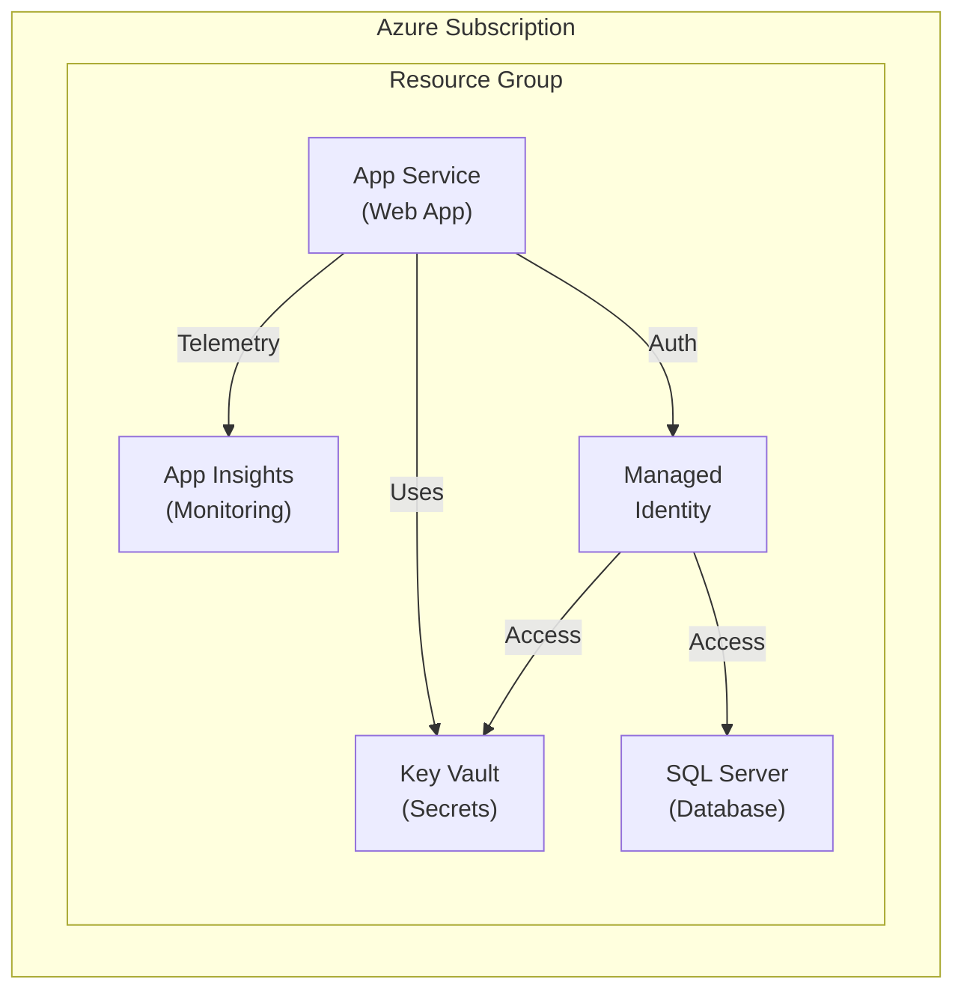

# Rental Repairs - Azure Bicep Infrastructure

This directory contains Azure Bicep templates for provisioning the complete infrastructure needed to run the Rental Repairs application on Azure.

## Overview

The Bicep templates deploy a cost-optimized .NET 8 web application infrastructure with the following Azure resources:

- **App Service** - Windows-based web hosting with .NET 8 runtime
- **SQL Server & Database** - Azure SQL with serverless compute for cost optimization
- **Key Vault** - Secure secrets management with managed identity integration
- **Application Insights** - Application performance monitoring and diagnostics


## Architecture



## Directory Structure

```
bicep/
├── main.bicep                    # Main orchestration template
├── parameters.json               # Your configuration values
├── parameters.example.json       # Template for creating parameters.json
├── modules/                      # Reusable Bicep modules
│   ├── appServicePlan.bicep
│   ├── webApp.bicep
│   ├── sqlServer.bicep
│   ├── sqlDatabase.bicep
│   ├── keyVault.bicep
│   └── applicationInsights.bicep
└── docs/                         # Documentation
    ├── README.md                 # This file
    ├── DEPLOYMENT_GUIDE.md       # Step-by-step deployment instructions
    ├── GETTING_STARTED.md        # Quick start guide
    └── QUICK_REFERENCE.md        # Common commands and operations
```

## Prerequisites

Before deploying, ensure you have:

1. **Azure Subscription** - An active Azure subscription
2. **Azure CLI** - Version 2.50.0 or later
3. **Bicep CLI** - Version 0.20.0 or later (installed with Azure CLI)
4. **Permissions** - Contributor or Owner role on the subscription
5. **PowerShell** - PowerShell 7+ (for Windows users) or Bash

## Quick Start

### 1. Install Prerequisites

```powershell
# Install or update Azure CLI
winget install Microsoft.AzureCLI

# Verify installation
az --version
az bicep version
```

### 2. Login to Azure

```powershell
az login
az account set --subscription "YOUR_SUBSCRIPTION_ID"
```

### 3. Configure Parameters

Copy the example parameters file and customize it:

```powershell
cp parameters.example.json parameters.json
```

Edit `parameters.json` and set:
- `sqlAdminPassword` - Strong password (min 12 characters)
- `localIpAddress` - Your public IP (if `allowLocalIp` is true)
- Other values as needed

### 4. Deploy Infrastructure

```powershell
# Deploy to Azure
az deployment sub create \
  --name "rentalrepairs-$(Get-Date -Format 'yyyyMMddHHmmss')" \
  --location canadacentral \
  --template-file main.bicep \
  --parameters @parameters.json
```

### 5. Post-Deployment Steps

After deployment completes:

1. **Grant Key Vault Access** - Update Key Vault access policy with Web App's managed identity
2. **Deploy Application Code** - Publish your .NET application to the Web App
3. **Run Database Migrations** - Apply Entity Framework migrations
4. **Test Application** - Visit the Web App URL and verify functionality

## Cost Optimization

The default configuration is optimized for cost:


### Cost-Saving Features

1. **Serverless SQL Database** (Default)
   - Auto-pauses after 60 minutes of inactivity
   - Pay only for compute time used
   - 84-98% savings vs always-on Basic tier

2. **Free App Service Tier Option**
   - F1 tier completely free
   - Suitable for demos and portfolios
   - 60 minutes CPU time/day limit

## Configuration Options

### Environment Types

```json
"environment": "dev"      // Development
"environment": "staging"  // Staging/Testing
"environment": "prod"     // Production
```

### App Service SKUs

```json
"appServiceSku": "F1"     // Free (demos, portfolios)
"appServiceSku": "B1"     // Basic ($13/month)
"appServiceSku": "S1"     // Standard ($70/month)
"appServiceSku": "P1v2"   // Premium ($146/month)
```

### SQL Database SKUs

```json
"sqlDatabaseSku": "GP_S_Gen5"  // Serverless (default, cost-effective)
"sqlDatabaseSku": "Basic"      // Basic tier ($5/month)
"sqlDatabaseSku": "S0"         // Standard S0 ($15/month)
"sqlDatabaseSku": "S1"         // Standard S1 ($30/month)
```

## Security Features

1. **Managed Identity** - No passwords in application code
2. **Key Vault Integration** - Secure secret storage
3. **HTTPS Only** - All connections encrypted
4. **TLS 1.2+** - Modern encryption standards
5. **Firewall Rules** - Controlled database access
6. **Soft Delete** - 7-day recovery window for deleted secrets

## Monitoring & Diagnostics

- **Application Insights** - Real-time performance monitoring
- **Health Checks** - Automatic endpoint monitoring at `/health`
- **Logs** - Application and diagnostic logs
- **Metrics** - CPU, memory, request rates, response times
- **Alerts** - Configurable alerts for issues

## Documentation

- [GETTING_STARTED.md](GETTING_STARTED.md) - Quick start checklist
- [DEPLOYMENT_GUIDE.md](DEPLOYMENT_GUIDE.md) - Detailed deployment instructions
- [QUICK_REFERENCE.md](QUICK_REFERENCE.md) - Common commands and troubleshooting


## Support & Resources

- **Azure Bicep Documentation**: https://learn.microsoft.com/azure/azure-resource-manager/bicep/
- **Bicep Playground**: https://aka.ms/bicepdemo
- **Azure CLI Reference**: https://learn.microsoft.com/cli/azure/
- **GitHub Issues**: Report issues in the project repository

## License

This infrastructure code is part of the Rental Repairs project and is licensed under the same terms as the main project.

## Next Steps

1. Review the [GETTING_STARTED.md](GETTING_STARTED.md) guide
2. Follow the [DEPLOYMENT_GUIDE.md](DEPLOYMENT_GUIDE.md) for detailed deployment steps
3. Customize the templates for your specific needs
4. Deploy to staging environment first
5. Test thoroughly before production deployment
