# Architecture Highlights

This document provides a **portfolio-focused overview** of the architectural patterns and design decisions demonstrated in the RentalRepairs Clean Architecture project.

## Executive Summary

This project showcases **enterprise-grade .NET architecture** with:
- **Clean Architecture** with proper dependency inversion
- **Domain-Driven Design** with rich business models
- **CQRS** pattern with MediatR implementation  
- **Event-Driven Architecture** with 20+ domain events
- **Comprehensive testing** across all layers

## Clean Architecture Implementation

```mermaid
graph TB
    subgraph "🖥️ Presentation Layer"
        RP[Razor Pages<br/>• Server-side rendering<br/>• Role-based views<br/>• Bootstrap 5 UI]
        VM[View Models<br/>• Input validation<br/>• Display formatting<br/>• Mapping logic]
    end
    
    subgraph "🚀 Application Layer"
        MR[MediatR Pipeline<br/>• CQRS implementation<br/>• 45+ handlers<br/>• Behavior pipeline]
        AS[Application Services<br/>• Workflow orchestration<br/>• DTO mapping<br/>• Validation]
    end
    
    subgraph "🏛️ Domain Layer"
        AG[Domain Aggregates<br/>• Rich business logic<br/>• Encapsulated rules<br/>• Event publishing]
        DS[Domain Services<br/>• Cross-aggregate logic<br/>• Complex algorithms<br/>• Policy enforcement]
    end
    
    subgraph "🔧 Infrastructure Layer"
        EF[Entity Framework<br/>• Repository pattern<br/>• Unit of Work<br/>• Query optimization]
        ES[External Services<br/>• Email notifications<br/>• Authentication<br/>• Caching]
    end
    
    RP --> VM
    VM --> MR
    MR --> AS
    AS --> AG
    AS --> DS
    AG --> EF
    DS --> ES
    
    style AG fill:#e1f5fe
    style DS fill:#e8f5e8
    style AS fill:#fff3e0
    style EF fill:#fce4ec
```



## Domain-Driven Design 

### Rich Domain Model
The project demonstrates sophisticated domain modeling with **4 core aggregates**:

```mermaid
classDiagram
    class Property {
        <<Aggregate Root>>
        +RegisterTenant() Tenant
        +AddUnit(unitNumber) void
        +CalculateMetrics() PropertyMetrics
        +RequiresAttention() bool
        -ValidateUnitForTenantRegistration()
    }
    
    class TenantRequest {
        <<Aggregate Root>>
        +Submit() void
        +ScheduleWork(date, worker) void
        +ReportWorkCompleted(success) void
        +CalculateUrgencyPriority() int
        +IsOverdue() bool
    }
    
    class Worker {
        <<Aggregate Root>>
        +AssignToWork(workOrder, date) void
        +CompleteWork(workOrder, success) void
        +CalculateScoreForRequest(request) int
        +HasSpecializedSkills(skill) bool
        +IsAvailableForWork(date) bool
    }
    
    class Tenant {
        +SubmitRequest(title, description) TenantRequest
        +CanSubmitRequest(urgency) bool
        +GetNextAllowedSubmissionTime() DateTime?
        -ValidateSubmissionRules()
    }
    
    Property ||--o{ Tenant : manages
    Tenant ||--o{ TenantRequest : creates
    Worker ||--o{ TenantRequest : assigned_to
```

### Business Rules Enforcement

**Complex validation rules** implemented at the domain level:

| Rule Category | Implementation | Business Value |
|---------------|----------------|----------------|
| **Rate Limiting** | Max 5 requests per 24h, Max 2 emergency per 7 days | Prevents system abuse |
| **Worker Assignment** | Skill matching, availability checking, workload balancing | Optimal resource allocation |
| **Status Transitions** | Valid state machine with business rule validation | Data integrity |
| **Emergency Handling** | Priority routing and specialized protocols | Critical issue response |

## CQRS Pattern Implementation

### Command-Query Separation


### Benefits Demonstrated
- **Separation of Concerns**: Commands modify state, queries retrieve data
- **Optimized Operations**: Read and write operations can be optimized independently
- **Scalability**: Easy to scale read and write sides differently
- **Maintainability**: Clear handler responsibilities

## Event-Driven Architecture

### Domain Events Implementation


### Event Types Implemented
- **Property Events**: Registration, tenant changes, unit modifications
- **Request Events**: Creation, submission, scheduling, completion
- **Worker Events**: Registration, assignment, work completion
- **Integration Events**: Cross-system communication

## Testing Strategy

### Comprehensive Test Coverage

```mermaid
pyramid
    title Testing Pyramid
    
    section Unit Tests
        Domain Logic: 85%
        Application Services: 80%
        Value Objects: 90%
    
    section Integration Tests  
        Repository Layer: 75%
        API Endpoints: 70%
        Database Operations: 80%
    
    section End-to-End Tests
        User Workflows: 60%
        Authentication: 70%
        Business Scenarios: 65%
```

### Key Testing Patterns
- **Domain Model Testing**: Rich entity behavior validation
- **Application Service Testing**: Use case verification
- **Architecture Testing**: Dependency rule enforcement
- **Integration Testing**: External system interaction
- **Performance Testing**: Load and stress scenarios

## Advanced Patterns Demonstrated

### 1. Specification Pattern
```csharp
// Complex query logic encapsulation
public class OverdueTenantRequestsSpecification : BaseSpecification<TenantRequest>
{
    public OverdueTenantRequestsSpecification() : base(r => 
        !r.Status.IsCompletedStatus() && 
        r.CreatedAt < DateTime.UtcNow.AddHours(-GetExpectedHours(r.UrgencyLevel)))
    {
        AddInclude(r => r.Property);
        AddInclude(r => r.Tenant);
        AddOrderBy(r => r.UrgencyLevel);
    }
}
```

### 2. Policy Pattern
```csharp
// Business rule encapsulation
public class TenantRequestSubmissionPolicy : ITenantRequestSubmissionPolicy
{
    public bool CanSubmitRequest(Tenant tenant, TenantRequestUrgency urgency)
    {
        return ValidateRateLimit(tenant) && 
               ValidateEmergencyLimit(tenant, urgency) &&
               ValidateNoDuplicates(tenant);
    }
}
```

### 3. Builder Pattern
```csharp
// Test data creation
var request = TenantRequestTestDataBuilder.Default()
    .ForEmergencyIssue()
    .WithTenant(tenantId, "John Doe", "john@test.com", "101")
    .WithProperty(propertyId, "Test Property", "555-1234")
    .BuildSubmitted();
```

## Performance Optimizations

### Database Optimizations
- **Entity Framework Configuration**: Custom configurations for complex relationships
- **Query Optimization**: Strategic use of Include() and projection
- **Caching Strategy**: Memory caching for frequently accessed data
- **Bulk Operations**: Efficient handling of large data sets

### Application Performance
- **Async/Await**: Throughout the application stack
- **Memory Management**: Proper disposal patterns
- **Connection Management**: Optimized database connections
- **Response Compression**: Reduced payload sizes

## Security Implementation

### Authentication & Authorization
- **ASP.NET Core Identity**: User management and authentication
- **Role-Based Access Control**: Fine-grained permissions
- **CSRF Protection**: Cross-site request forgery prevention
- **Input Validation**: Multi-layer validation strategy

### Data Protection
- **Sensitive Data Handling**: Proper encryption and masking
- **Audit Trails**: Comprehensive change tracking
- **Error Handling**: Secure error responses
- **Logging**: Security event monitoring

## Portfolio Value Proposition

This project demonstrates:

### Technical Leadership Skills
- **Architectural Decision Making**: Proper pattern selection and implementation
- **Code Quality**: Clean, maintainable, well-documented code
- **Testing Excellence**: Comprehensive testing strategy
- **Performance Awareness**: Optimization considerations throughout

### Business Understanding
- **Domain Modeling**: Complex business rule implementation
- **User Experience**: Role-based interfaces and workflows
- **Scalability Planning**: Architecture that supports growth
- **Maintenance Considerations**: Long-term code maintainability

### Industry Best Practices
- **SOLID Principles**: Consistent application throughout
- **DRY Principle**: Effective code reuse strategies
- **Separation of Concerns**: Clear layer boundaries
- **Dependency Injection**: Proper IoC implementation

---

**For complete technical documentation with detailed diagrams, see [Domain Model Diagrams](domain-model-diagrams.md).**