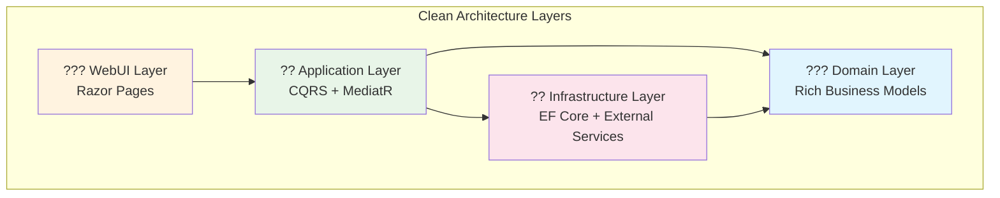

# Architecture Summary

A **concise overview** of the RentalRepairs Clean Architecture implementation for quick reference.

## Core Architecture

## Domain Model

### Core Aggregates
- **Property** - Manages rental units and tenants
- **TenantRequest** - Rich workflow with business validation  
- **Worker** - Specialized skills and availability tracking
- **Tenant** - Request submission with rate limiting

### Key Patterns
- **Value Objects**: `PropertyAddress`, `PersonContactInfo`, `SchedulingSlot`
- **Domain Events**: 20+ events for loose coupling
- **Specifications**: Complex query encapsulation
- **Domain Services**: Cross-aggregate business logic

## CQRS Implementation

- **45+ Handlers** for commands and queries
- **MediatR Pipeline** with validation and logging behaviors
- **Separate Models** for read and write operations
- **Event Publishing** for cross-cutting concerns

## Testing Strategy

- **Unit Tests**: Domain logic and business rules
- **Integration Tests**: Database and external services  
- **End-to-End Tests**: Complete user workflows
- **Architecture Tests**: Dependency rule enforcement

## Quick Links

- **?? [Complete Diagrams](domain-model-diagrams.md)** - Technical deep dive
- **??? [Architecture Highlights](architecture-highlights.md)** - Portfolio overview
- **?? [Business Rules](business-rules.md)** - Domain logic details
- **?? [Main README](../README.md)** - Getting started

---

**Built with .NET 8, demonstrating enterprise-grade architecture patterns and best practices.**