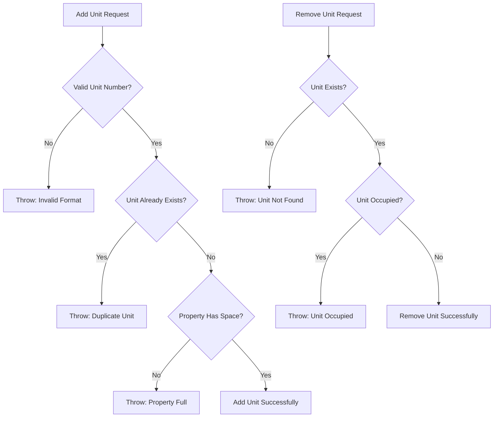
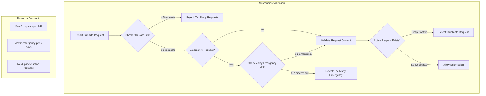
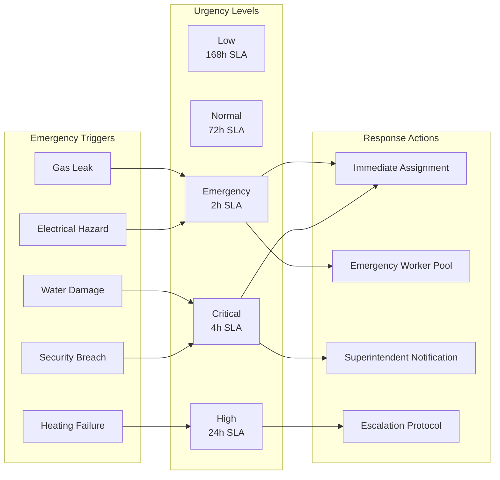
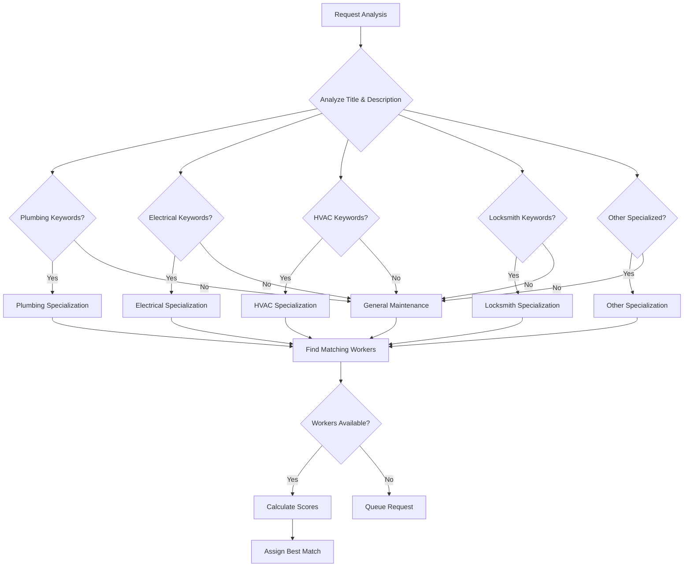
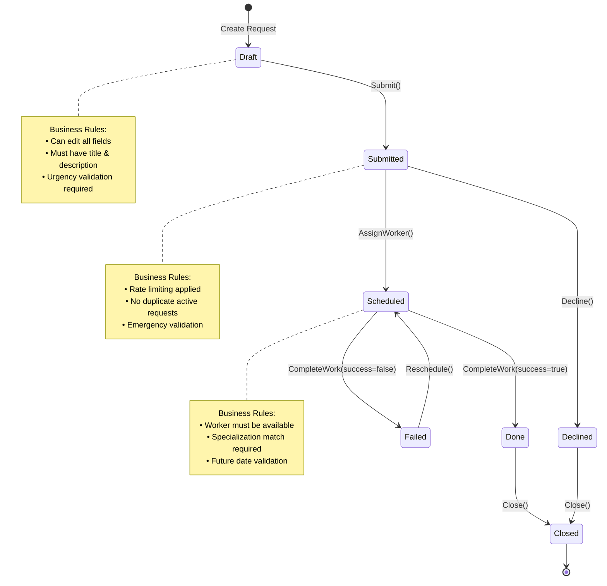
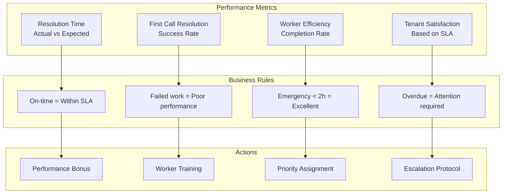
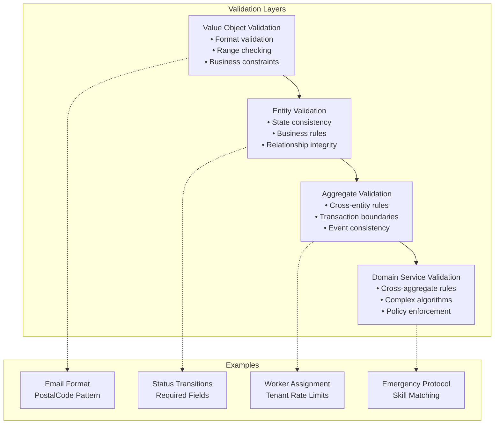

# Business Rules Documentation

This document outlines the **sophisticated business rules** implemented in the RentalRepairs domain model, demonstrating complex business logic encapsulation and validation.

## Overview

The RentalRepairs system implements **enterprise-grade business rules** across multiple domains:
- **Tenant Request Management** with rate limiting and validation
- **Worker Assignment Logic** with skill matching and availability
- **Property Management** with occupancy and maintenance rules
- **Workflow State Management** with transition validation

## Property Management Rules

### Unit Management


### Business Rules Implementation
```csharp
// Property aggregate encapsulates unit management rules
public void AddUnit(string unitNumber)
{
    if (!IsValidUnitNumber(unitNumber))
        throw new PropertyDomainException($"Unit number '{unitNumber}' has invalid format");
    
    if (Units.Contains(unitNumber))
        throw new PropertyDomainException($"Unit {unitNumber} already exists");
    
    Units.Add(unitNumber);
    AddDomainEvent(new UnitAddedEvent(this, unitNumber));
}

private static bool IsValidUnitNumber(string unitNumber)
{
    return !string.IsNullOrWhiteSpace(unitNumber) && 
           unitNumber.Length <= 10 && 
           Regex.IsMatch(unitNumber, @"^[A-Za-z0-9\-\s]+$");
}
```

## Tenant Request Submission Rules

### Rate Limiting Logic


### Implementation Details
```csharp
public class TenantRequestSubmissionPolicy : ITenantRequestSubmissionPolicy
{
    private const int MaxRequestsPer24Hours = 5;
    private const int MaxEmergencyRequestsPer7Days = 2;
    
    public void ValidateCanSubmitRequest(Tenant tenant, TenantRequestUrgency urgency)
    {
        ValidateRateLimit(tenant);
        
        if (urgency.IsEmergency())
        {
            ValidateEmergencyLimit(tenant);
        }
        
        ValidateNoDuplicateActiveRequests(tenant);
    }
    
    private void ValidateRateLimit(Tenant tenant)
    {
        var recentRequests = tenant.Requests.Count(r => 
            r.WasSubmittedWithinHours(24));
            
        if (recentRequests >= MaxRequestsPer24Hours)
        {
            throw new TenantRequestSubmissionPolicyException(
                $"Tenant has submitted {recentRequests} requests in the last 24 hours. Maximum allowed: {MaxRequestsPer24Hours}");
        }
    }
}
```

## Emergency Request Handling

### Priority Classification


### Business Logic
```csharp
public bool RequiresImmediateAttention()
{
    // Complex business rule for immediate attention
    return IsEmergency || 
           (Status == TenantRequestStatus.Submitted && 
            CreatedAt <= DateTime.UtcNow.AddDays(-2));
}

public int GetExpectedResolutionHours()
{
    return UrgencyLevel switch
    {
        "Emergency" => 2,    // Critical response time
        "Critical" => 4,     // High priority
        "High" => 24,        // Next business day
        "Normal" => 72,      // Standard SLA
        "Low" => 168,        // Weekly resolution
        _ => 72              // Default fallback
    };
}
```

## Worker Assignment Algorithm

### Skill Matching Logic


### Scoring Algorithm
```csharp
public int CalculateScoreForRequest(TenantRequest request)
{
    var score = 0;
    
    // Base score for active workers
    if (!IsActive) return 0;
    score += 100;
    
    // Specialization matching (highest weight)
    var requiredSpec = DetermineRequiredSpecialization(request.Title, request.Description);
    if (HasSpecializedSkills(requiredSpec))
    {
        if (Specialization?.Equals(requiredSpec, StringComparison.OrdinalIgnoreCase) == true)
        {
            score += 200; // Exact match gets highest score
        }
        else
        {
            score += 100; // General maintenance capability
        }
    }
    
    // Availability bonus
    if (IsAvailableForWork(DateTime.Today.AddDays(1)))
    {
        score += 50;
    }
    
    // Workload consideration (lower is better)
    var workload = GetUpcomingWorkloadCount(DateTime.UtcNow);
    score += Math.Max(0, (10 - workload) * 10);
    
    // Emergency handling bonus
    if (request.IsEmergency && IsEmergencyResponseCapable())
    {
        score += 30;
    }
    
    return score;
}
```

## Status Transition Rules

### State Machine Implementation


### Validation Logic
```csharp
public void ValidateCanBeScheduled(DateTime scheduledDate, string workerEmail, string workOrderNumber)
{
    // Business rule: Only submitted and failed requests can be scheduled
    if (Status != TenantRequestStatus.Submitted && Status != TenantRequestStatus.Failed)
    {
        throw new TenantRequestDomainException(
            $"Request can only be scheduled from Submitted or Failed status. Current: {Status}");
    }
    
    // Business rule: Future date requirement
    if (scheduledDate <= DateTime.UtcNow)
    {
        throw new TenantRequestDomainException("Scheduled date must be in the future");
    }
    
    // Business rule: Worker assignment validation
    if (string.IsNullOrWhiteSpace(workerEmail))
    {
        throw new TenantRequestDomainException("Worker email is required for scheduling");
    }
}
```

## Performance and Analytics Rules  

### Metrics Calculation


### Implementation Examples
```csharp
// Performance scoring business logic
public double CalculateResolutionPerformanceScore()
{
    if (!CompletedDate.HasValue) return 0;
    
    var actualHours = (CompletedDate.Value - CreatedAt).TotalHours;
    var expectedHours = GetExpectedResolutionHours();
    
    if (actualHours <= expectedHours)
        return 100; // On time = perfect score
    
    // Calculate penalty for being late
    var latePenalty = Math.Min(50, (actualHours - expectedHours) / expectedHours * 50);
    return Math.Max(0, 100 - latePenalty);
}

// Property attention requirement
public bool RequiresAttention()
{
    const double AttentionThreshold = 0.8; // Business rule constant
    return GetOccupancyRate() < AttentionThreshold;
}
```

## Data Integrity Rules

### Validation Hierarchy


## Business Rule Benefits

### Encapsulation Advantages
- **Single Source of Truth**: Business rules defined once in domain
- **Consistency**: Same rules applied across all entry points
- **Testability**: Business logic isolated and easily tested
- **Maintainability**: Changes made in one place
- **Documentation**: Code serves as living documentation

### Quality Assurance
- **Domain Expert Validation**: Rules match business requirements
- **Edge Case Handling**: Comprehensive error scenarios covered
- **Performance Optimization**: Efficient rule evaluation
- **Audit Trail**: Business rule execution tracked

---

**This comprehensive business rules implementation demonstrates enterprise-grade domain modeling and validation strategies suitable for complex business applications.**