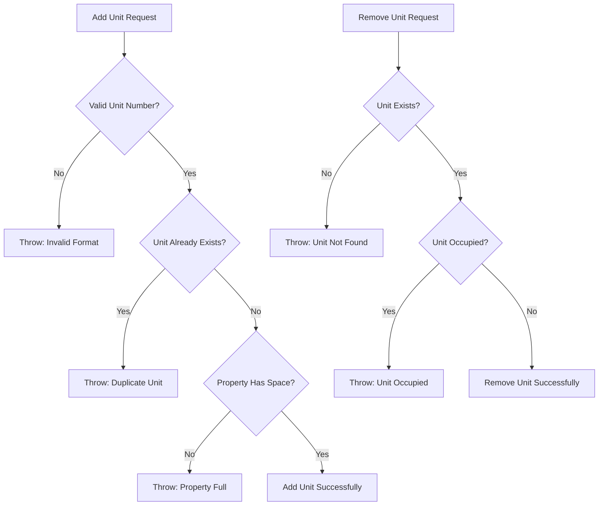
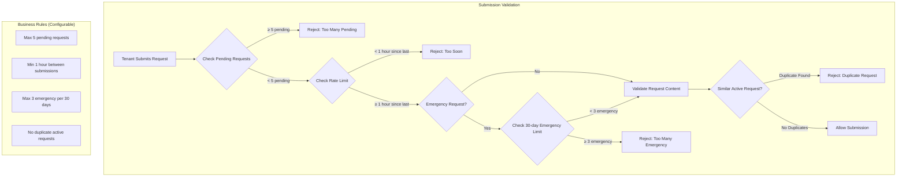
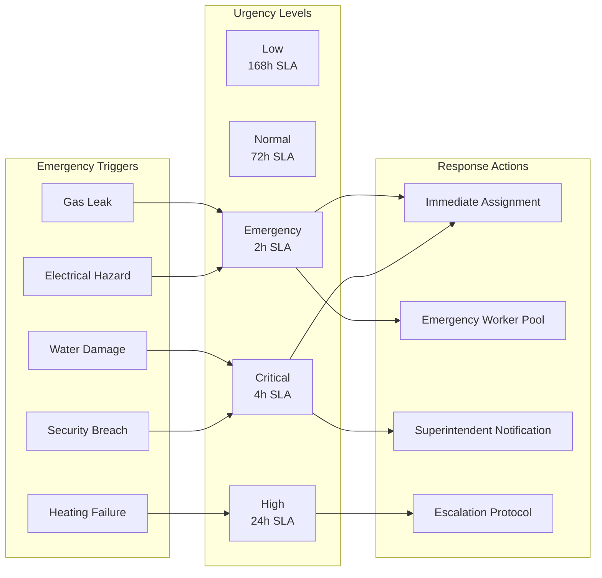
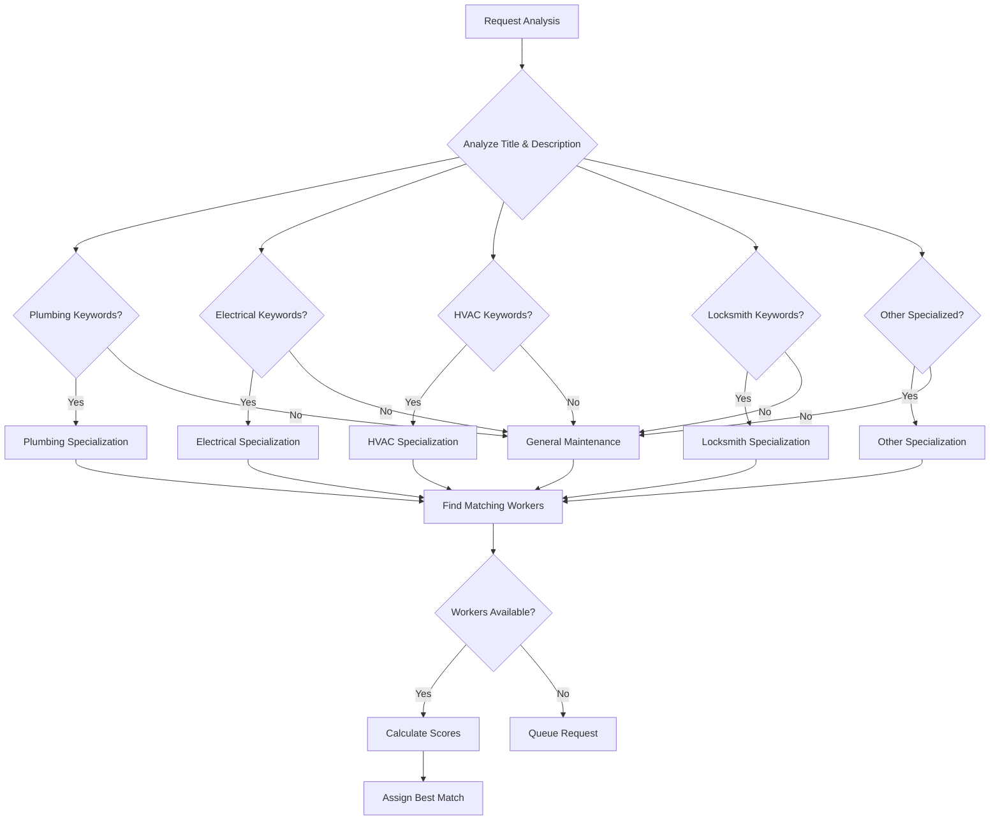
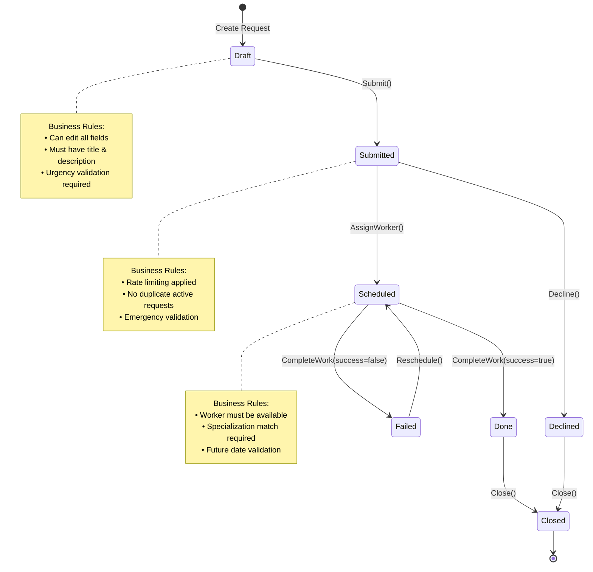
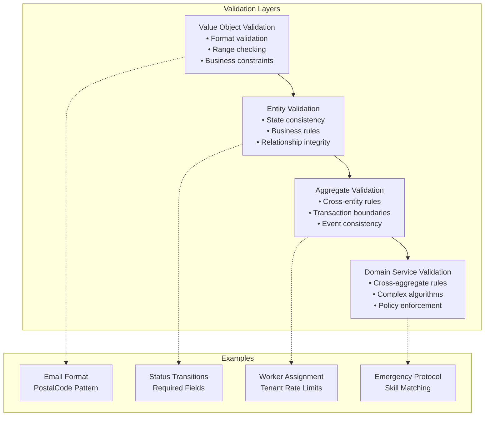

# Business Rules Documentation

This document outlines the **sophisticated business rules** implemented in the RentalRepairs domain model, demonstrating complex business logic encapsulation and validation.

## Overview

The RentalRepairs system implements **enterprise-grade business rules** across multiple domains:
- **Tenant Request Management** with rate limiting and validation
- **Worker Assignment Logic** with skill matching and availability
- **Property Management** with occupancy and maintenance rules
- **Workflow State Management** with transition validation

## Property Management Rules

### Unit Management


### Business Rules Implementation
```csharp
// Property aggregate encapsulates unit management rules
public void AddUnit(string unitNumber)
{
    if (!IsValidUnitNumber(unitNumber))
        throw new PropertyDomainException($"Unit number '{unitNumber}' has invalid format");
    
    if (Units.Contains(unitNumber))
        throw new PropertyDomainException($"Unit {unitNumber} already exists");
    
    Units.Add(unitNumber);
    AddDomainEvent(new UnitAddedEvent(this, unitNumber));
}

private static bool IsValidUnitNumber(string unitNumber)
{
    return !string.IsNullOrWhiteSpace(unitNumber) && 
           unitNumber.Length <= 10 && 
           Regex.IsMatch(unitNumber, @"^[A-Za-z0-9\-\s]+$");
}
```

## Tenant Request Submission Rules

### Rate Limiting Logic


### Implementation Details

**Configurable Business Rules via appsettings.json**

The system uses a **configurable policy approach** allowing business rules to be adjusted without code changes:

```csharp
// Configuration model - values loaded from appsettings.json
public class TenantRequestPolicyConfiguration
{
    public int MaxPendingRequests { get; set; } = 5;
    public int MinimumHoursBetweenSubmissions { get; set; } = 1;
    public int MaxEmergencyRequestsPerMonth { get; set; } = 3;
    public int EmergencyRequestLookbackDays { get; set; } = 30;

    public bool IsRateLimitingEnabled => MinimumHoursBetweenSubmissions > 0;
    public bool IsEmergencyLimitingEnabled => MaxEmergencyRequestsPerMonth > 0;
    public TimeSpan RateLimitTimeSpan => TimeSpan.FromHours(MinimumHoursBetweenSubmissions);
    public TimeSpan EmergencyLookbackTimeSpan => TimeSpan.FromDays(EmergencyRequestLookbackDays);
}

// Policy implementation using configuration
public class TenantRequestSubmissionPolicy : ITenantRequestSubmissionPolicy
{
    private readonly TenantRequestPolicyConfiguration _configuration;

    public TenantRequestSubmissionPolicy(TenantRequestPolicyConfiguration configuration)
    {
        _configuration = configuration ?? throw new ArgumentNullException(nameof(configuration));
    }

    public void ValidateCanSubmitRequest(Tenant tenant, TenantRequestUrgency urgency)
    {
        // Business Rule 1: Maximum pending requests
        ValidateMaxPendingRequests(tenant);

        // Business Rule 2: Rate limiting between submissions (if enabled)
        if (_configuration.IsRateLimitingEnabled)
        {
            ValidateRateLimit(tenant);
        }

        // Business Rule 3: Emergency request limitations (if enabled)
        if (_configuration.IsEmergencyLimitingEnabled && urgency == TenantRequestUrgency.Emergency)
        {
            ValidateEmergencyRequestLimit(tenant);
        }
    }

    private void ValidateMaxPendingRequests(Tenant tenant)
    {
        int activeRequestsCount = tenant.Requests.Count(r =>
            r.Status is TenantRequestStatus.Submitted or TenantRequestStatus.Scheduled);

        if (activeRequestsCount >= _configuration.MaxPendingRequests)
        {
            throw new MaxPendingRequestsExceededException(
                _configuration.MaxPendingRequests, activeRequestsCount);
        }
    }

    private void ValidateRateLimit(Tenant tenant)
    {
        TenantRequest? lastSubmission = tenant.Requests
            .Where(r => r.Status != TenantRequestStatus.Draft)
            .OrderByDescending(r => r.CreatedAt)
            .FirstOrDefault();

        if (lastSubmission != null)
        {
            TimeSpan timeSinceLastSubmission = DateTime.UtcNow - lastSubmission.CreatedAt;
            TimeSpan minimumWaitTime = _configuration.RateLimitTimeSpan;

            if (timeSinceLastSubmission < minimumWaitTime)
            {
                TimeSpan waitTime = minimumWaitTime - timeSinceLastSubmission;
                throw new SubmissionRateLimitExceededException(waitTime);
            }
        }
    }

    private void ValidateEmergencyRequestLimit(Tenant tenant)
    {
        int emergencyRequestsInPeriod = tenant.Requests
            .Count(r => r.UrgencyLevel == "Emergency" &&
                        r.CreatedAt > DateTime.UtcNow.Subtract(_configuration.EmergencyLookbackTimeSpan));

        if (emergencyRequestsInPeriod >= _configuration.MaxEmergencyRequestsPerMonth)
        {
            throw new EmergencyRequestLimitExceededException(
                _configuration.MaxEmergencyRequestsPerMonth, emergencyRequestsInPeriod);
        }
    }
}
```

**Configuration Example (appsettings.json):**
```json
{
  "TenantRequestSubmission": {
    "MaxPendingRequests": 5,
    "MinimumHoursBetweenSubmissions": 1,
    "MaxEmergencyRequestsPerMonth": 3,
    "EmergencyRequestLookbackDays": 30
  }
}
```

**Benefits of Configurable Approach:**
- ✅ Business rules can be adjusted without code deployment
- ✅ Different rules for different environments (dev, staging, production)
- ✅ Easy A/B testing of business rule variations
- ✅ Quick response to changing business requirements
- ✅ Rules can be disabled by setting values to 0

## Emergency Request Handling

### Priority Classification


### Business Logic
```csharp
public bool RequiresImmediateAttention()
{
    // Complex business rule for immediate attention
    return IsEmergency || 
           (Status == TenantRequestStatus.Submitted && 
            CreatedAt <= DateTime.UtcNow.AddDays(-2));
}

public int GetExpectedResolutionHours()
{
    return UrgencyLevel switch
    {
        "Emergency" => 2,    // Critical response time
        "Critical" => 4,     // High priority
        "High" => 24,        // Next business day
        "Normal" => 72,      // Standard SLA
        "Low" => 168,        // Weekly resolution
        _ => 72              // Default fallback
    };
}
```

## Worker Assignment Algorithm

### Skill Matching Logic


### Scoring Algorithm
```csharp
public int CalculateScoreForRequest(TenantRequest request)
{
    var score = 0;
    
    // Base score for active workers
    if (!IsActive) return 0;
    score += 100;
    
    // Specialization matching (highest weight)
    var requiredSpec = DetermineRequiredSpecialization(request.Title, request.Description);
    if (HasSpecializedSkills(requiredSpec))
    {
        if (Specialization?.Equals(requiredSpec, StringComparison.OrdinalIgnoreCase) == true)
        {
            score += 200; // Exact match gets highest score
        }
        else
        {
            score += 100; // General maintenance capability
        }
    }
    
    // Availability bonus
    if (IsAvailableForWork(DateTime.Today.AddDays(1)))
    {
        score += 50;
    }
    
    // Workload consideration (lower is better)
    var workload = GetUpcomingWorkloadCount(DateTime.UtcNow);
    score += Math.Max(0, (10 - workload) * 10);
    
    // Emergency handling bonus
    if (request.IsEmergency && IsEmergencyResponseCapable())
    {
        score += 30;
    }
    
    return score;
}
```

## Status Transition Rules

### State Machine Implementation


### Validation Logic
```csharp
public void ValidateCanBeScheduled(DateTime scheduledDate, string workerEmail, string workOrderNumber)
{
    // Business rule: Only submitted and failed requests can be scheduled
    if (Status != TenantRequestStatus.Submitted && Status != TenantRequestStatus.Failed)
    {
        throw new TenantRequestDomainException(
            $"Request can only be scheduled from Submitted or Failed status. Current: {Status}");
    }
    
    // Business rule: Future date requirement
    if (scheduledDate <= DateTime.UtcNow)
    {
        throw new TenantRequestDomainException("Scheduled date must be in the future");
    }
    
    // Business rule: Worker assignment validation
    if (string.IsNullOrWhiteSpace(workerEmail))
    {
        throw new TenantRequestDomainException("Worker email is required for scheduling");
    }
}
```


## Data Integrity Rules

### Validation Hierarchy


## Business Rule Benefits

### Encapsulation Advantages
- **Single Source of Truth**: Business rules defined once in domain
- **Consistency**: Same rules applied across all entry points
- **Testability**: Business logic isolated and easily tested
- **Maintainability**: Changes made in one place
- **Documentation**: Code serves as living documentation

### Quality Assurance
- **Domain Expert Validation**: Rules match business requirements
- **Edge Case Handling**: Comprehensive error scenarios covered
- **Performance Optimization**: Efficient rule evaluation
- **Audit Trail**: Business rule execution tracked

---

**This comprehensive business rules implementation demonstrates enterprise-grade domain modeling and validation strategies suitable for complex business applications.**
