# Domain Model Diagrams

This document contains comprehensive Mermaid diagrams for the Rental Repairs domain model, organized by different architectural views.

## Documentation Navigation

- **[Main README](../README.md)** - Project overview and getting started
- **[Architecture Highlights](architecture-highlights.md)** - Portfolio-focused architectural overview  
- **[Business Rules](business-rules.md)** - Detailed business logic documentation
- **[Getting Started Guide](GETTING_STARTED.md)** - Development setup
- **[Development Setup](DEVELOPMENT_SETUP.md)** - Local configuration

---

## Diagram Overview

This comprehensive technical reference provides **10 detailed views** of the domain architecture:

1. **Core Domain Entities** - Entity relationships and data model
2. **Value Objects** - Self-validating business concepts  
3. **Domain Events** - Event-driven architecture flows
4. **Domain Services** - Cross-aggregate business logic
5. **Status Workflows** - State machine implementations
6. **Worker Assignment** - Complex business algorithms
7. **Aggregate Boundaries** - DDD boundary definitions
8. **Clean Architecture** - Layer separation and dependencies
9. **Business Rules** - Validation and constraint flows
10. **Integration Patterns** - Event publishing and handling

---

## 1. Core Domain Entities and Relationships

## 2. Value Objects and Their Relationships

## 3. Domain Events and Event Flow

## 4. Domain Services Architecture

```mermaid
classDiagram
    direction TB
    
    class TenantRequestBusinessService {
        +ValidateRequestSubmission(tenant, urgency) bool
        +CalculateUrgentRequests(requests) List~TenantRequest~
        +GetOverdueRequests(requests) List~TenantRequest~
        +CalculatePerformanceMetrics(requests) Metrics
    }

    class WorkerAssignmentPolicyService {
        +FindBestWorkerForRequest(request, workers) Worker
        +ValidateWorkerAssignment(worker, request) ValidationResult
        +CalculateWorkerScores(workers, request) List~WorkerScore~
        +GetRecommendedWorkers(request, workers) List~WorkerRecommendation~
    }

    class RequestTitleGenerator {
        +GenerateTitleWithUrgency(description, urgency, customTitle) string
        +ValidateTitle(title) ValidationResult
        +SuggestTitleImprovements(title, description) List~string~
    }

    class TenantRequestUrgencyPolicy {
        +IsValidUrgencyLevel(urgency) bool
        +GetAllValidUrgencyLevels() List~string~
        +GetExpectedResolutionHours(urgency) int
        +DetermineUrgencyFromDescription(description) string
    }

    class TenantRequestStatusPolicy {
        +IsValidStatusTransition(from, to) bool
        +ValidateStatusTransition(from, to) ValidationResult
        +CanEditInStatus(status) bool
        +CanScheduleWorkInStatus(status) bool
        +GetStatusCategory(status) StatusCategory
        +RequiresAttention(status) bool
    }

    class PropertyDomainService {
        +ValidatePropertyCreation(property) ValidationResult
        +CalculateOccupancyMetrics(property) PropertyMetrics
        +FindAvailableUnits(property) List~string~
        +ValidateUnitRegistration(property, unit) ValidationResult
    }

    class RequestWorkflowManager {
        +GetNextValidStatuses(currentStatus) List~TenantRequestStatus~
        +CanTransitionTo(from, to) bool
        +GetWorkflowHistory(request) List~WorkflowStep~
        +ValidateWorkflowTransition(request, newStatus) ValidationResult
    }

    class UnitSchedulingService {
        +GetAvailableSlots(date, property) List~SchedulingSlot~
        +FindOptimalSlot(request, preferences) SchedulingSlot
        +ValidateSlotAvailability(slot, worker) bool
        +CreateScheduleRecommendation(request, worker) ScheduleRecommendation
    }

    TenantRequestBusinessService ..> TenantRequestUrgencyPolicy : uses
    TenantRequestBusinessService ..> TenantRequestStatusPolicy : uses
    WorkerAssignmentPolicyService ..> UnitSchedulingService : uses
    TenantRequest ..> RequestTitleGenerator : uses
    TenantRequest ..> TenantRequestStatusPolicy : uses
    Property ..> PropertyDomainService : uses
    Worker ..> WorkerAssignmentPolicyService : uses
```

## 5. Enum Types and Status Flow

## 6. Worker Specialization and Assignment Logic

## 7. Aggregate Boundaries and Context Map

## 8. Clean Architecture Layers

## 9. Business Rules and Validation Flow

## 10. Integration and Event Publishing

These diagrams provide a comprehensive view of your domain model, covering:

1. **Core entities and relationships** - The main aggregates and how they relate
2. **Value objects** - Self-validating, immutable objects that encapsulate business concepts
3. **Domain events** - How the system communicates changes across boundaries
4. **Domain services** - Business logic that doesn't belong to a single aggregate
5. **Status flows** - How tenant requests progress through their lifecycle
6. **Worker assignment logic** - Complex business rules for matching workers to requests
7. **Aggregate boundaries** - Clean separation of concerns following DDD principles
8. **Clean architecture** - How the layers interact while maintaining dependency rules
9. **Business rules** - Key validation and business logic constraints
10. **Integration patterns** - How events enable loose coupling and async processing

The diagrams show a well-designed domain with proper encapsulation, clear boundaries, and sophisticated business logic handling the complexities of rental property maintenance management.
