# Simple Demo Guide: Core Workflow

A **straightforward walkthrough** of the RentalRepairs application showing the basic maintenance request lifecycle.

## Core Workflow Overview

This guide demonstrates the **essential workflow** that every maintenance management system needs:

1. **Tenant** creates a maintenance request
2. **Superintendent** reviews and assigns a worker  
3. **Worker** completes the work
4. **Superintendent** closes the request

---

## Getting Started

### **Login Credentials**
```
👤 Tenant: tenant1.unit101@sunset.com / Demo123!
🏢 Superintendent: super.johnson@sunset.com / Demo123!  
🔧 Worker: plumber.smith@workers.com / Demo123!
```

### **Application URL**: `https://localhost:5001`

---

## Step 1: Tenant Creates Request

### **1.1 Tenant Login**

*Tenant logs in using their credentials*

### **1.2 Tenant Dashboard**
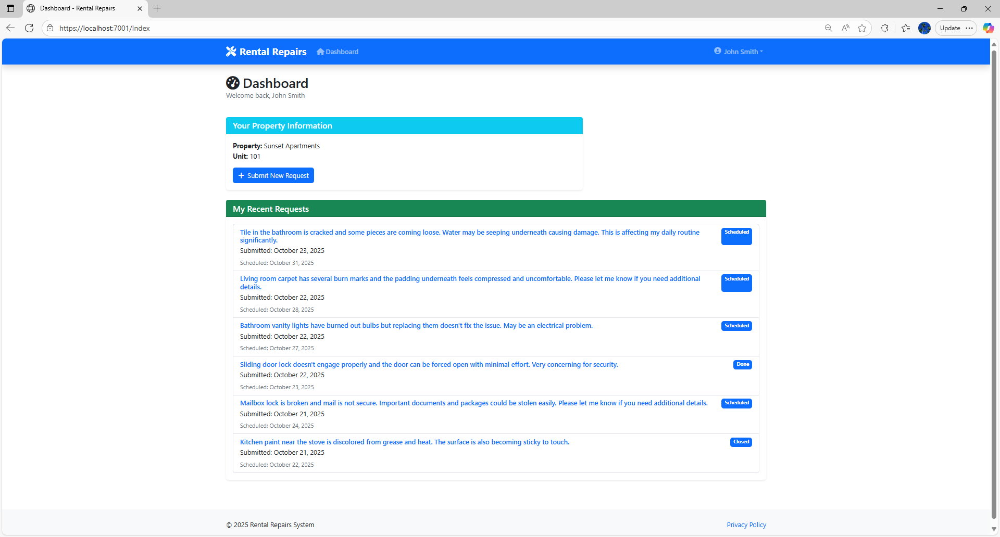
*Clean dashboard showing current requests and option to create new one*

### **1.3 Create New Request**
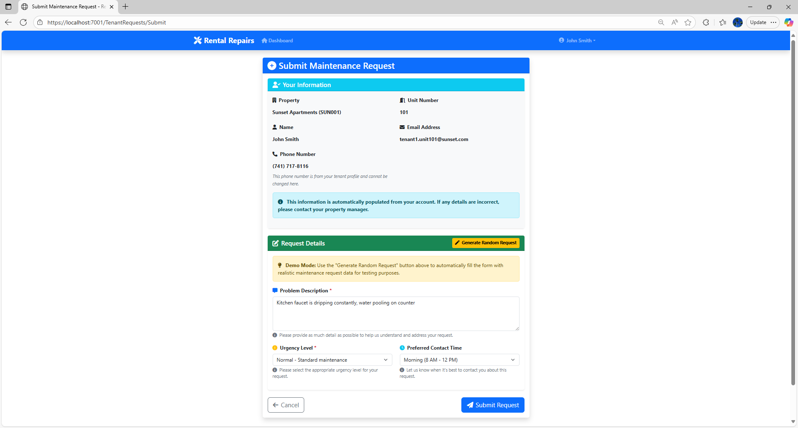
*Simple form for submitting maintenance request*

**Form Fields:**
- **Issue Title**: "Leaky Kitchen Faucet"
- **Description**: "Kitchen faucet is dripping constantly, water pooling on counter"
- **Urgency**: Normal
- **Preferred Contact Time**: Morning (8AM-12PM)

### **1.4 Request Submitted**
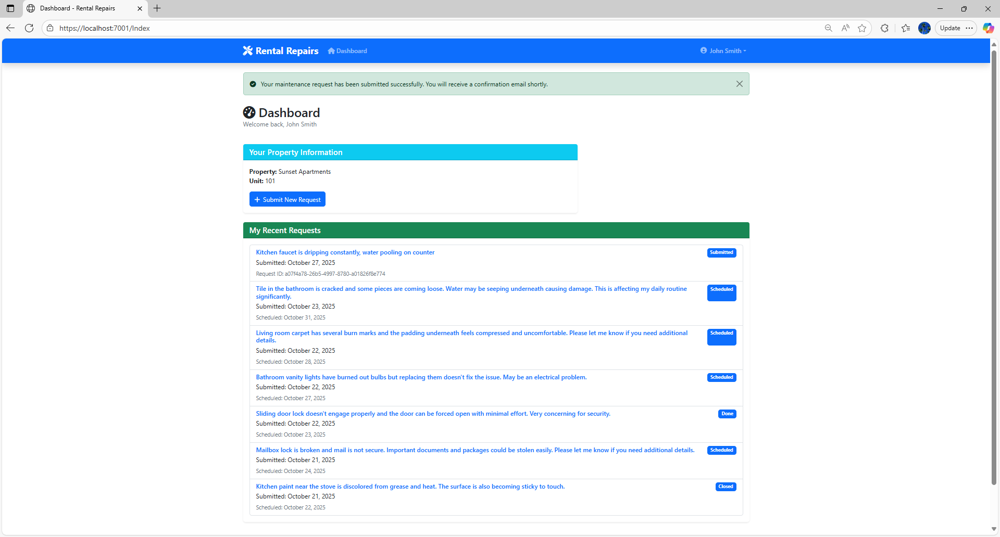
*Confirmation page showing request was created successfully*

**What Happens:**
- ✅ Request gets unique ID: `SUNSET-101-0001`
- ✅ Status: `Submitted`
- ✅ Notification sent to superintendent
- ✅ Tenant can track progress

---

## Step 2: Superintendent Assigns Worker

### **2.1 Superintendent Login** 
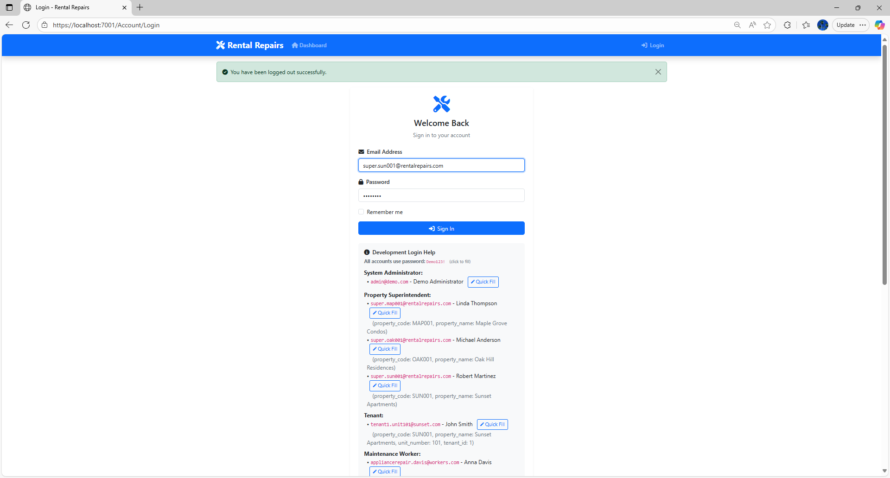
*Superintendent logs in to management portal*

### **2.2 Superintendent Dashboard**
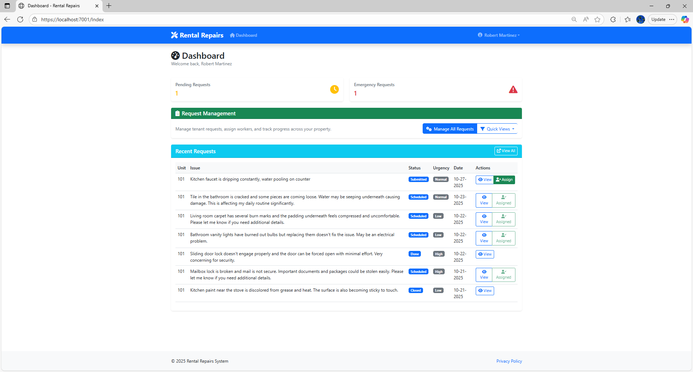
*Dashboard showing pending requests requiring assignment*

**Key Information:**
- 🔔 **1 New Request** requiring attention
- 📊 Property overview with occupancy stats
- 📋 Recent activity summary

### **2.3 Review Request Details**
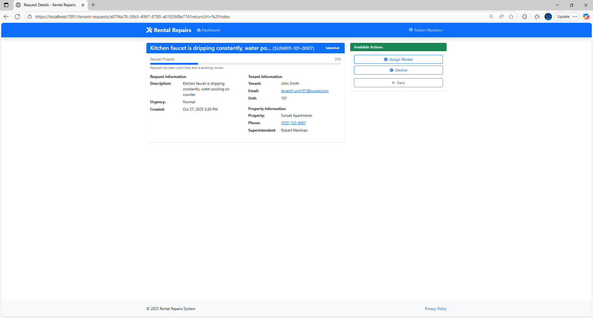
*Detailed view of the tenant's request*

**Request Information:**
- **Property**: Sunset Apartments
- **Unit**: 101
- **Tenant**: John Doe
- **Issue**: Leaky Kitchen Faucet
- **Submitted**: Today 9:15 AM
- **Urgency**: Normal

### **2.4 Worker Assignment**
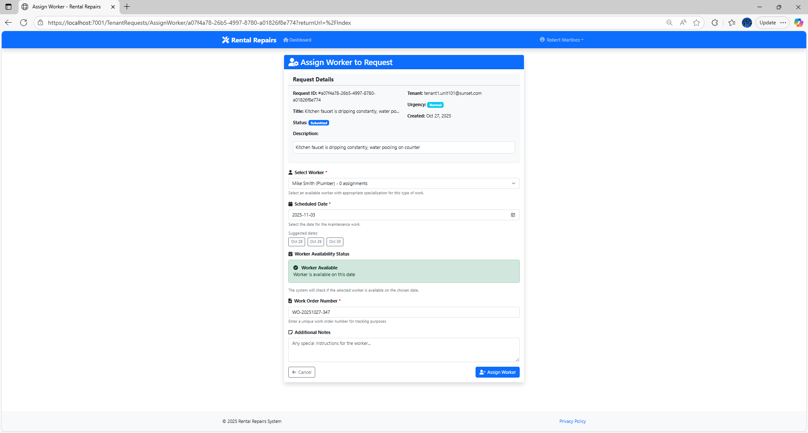
*Interface for selecting and assigning worker*

**Assignment Details:**
- **Worker Selected**: Mike Smith (Plumber)
- **Specialization Match**: ✅ Plumbing
- **Availability**: ✅ Available tomorrow
- **Scheduled Date**: Tomorrow 10:00 AM
- **Work Order**: WO-2024-0156

### **2.5 Assignment Confirmed**
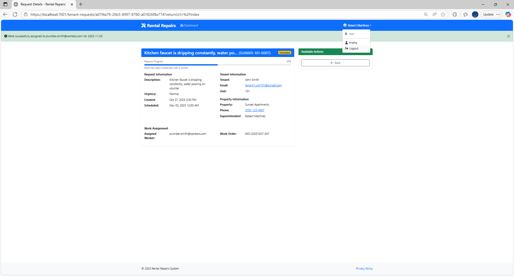
*Confirmation that worker has been assigned*

**What Happens:**
- ✅ Request status: `Scheduled`
- ✅ Worker gets notification
- ✅ Tenant gets update with worker info and schedule

---

## Step 3: Worker Completes Work

### **3.1 Worker Login**
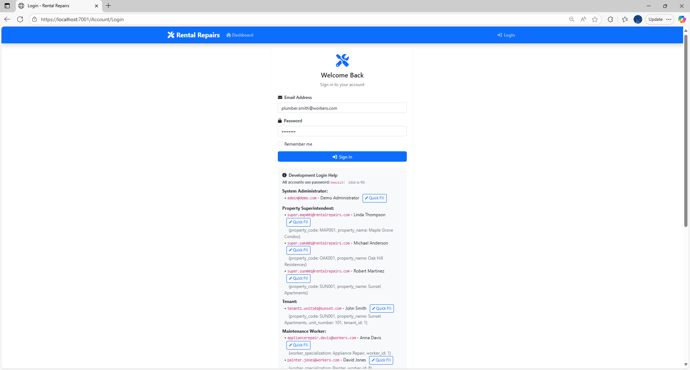
*Worker logs in to their work management portal*

### **3.2 Worker Dashboard**
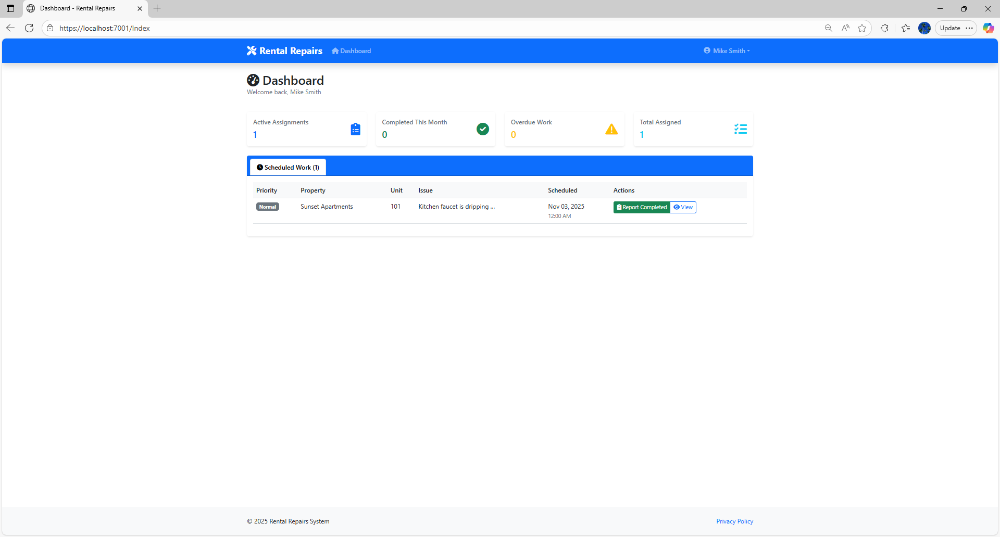
*Dashboard showing assigned work orders*

**Today's Schedule:**
- 🕙 **10:00 AM** - Sunset Apartments, Unit 101
- 🔧 **Work Order**: WO-2024-0156
- 🚰 **Issue**: Leaky Kitchen Faucet

### **3.3 Work Order Details**

*Detailed work instructions and tenant information*

**Work Details:**
- **Location**: Sunset Apartments, Unit 101
- **Contact**: John Doe - (555) 123-4567
- **Issue Description**: Kitchen faucet dripping constantly

### **3.4 Complete Work**
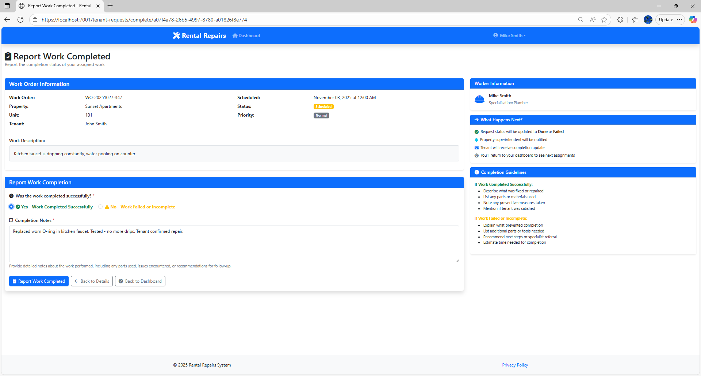
*Form for reporting work completion*

**Completion Details:**
- **Work Status**: ✅ Completed Successfully
- **Work Notes**: "Replaced worn O-ring in kitchen faucet. Tested - no more drips. Tenant confirmed repair."

### **3.5 Work Completed**
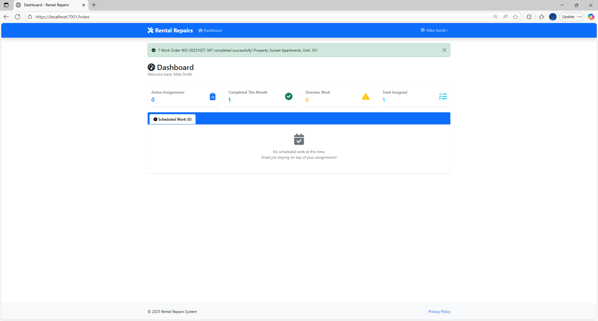
*Confirmation that work has been marked complete*

**What Happens:**
- ✅ Request status: `Done`
- ✅ Superintendent gets completion notification
- ✅ Tenant gets notification work is complete

---

## Step 4: Superintendent Closes Request

### **4.1 Review Completed Work**
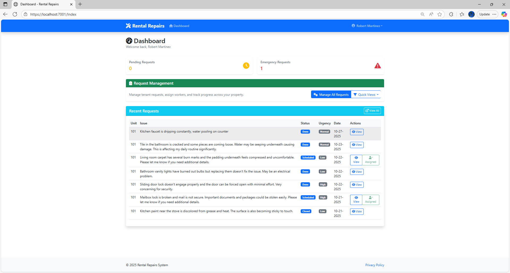
*Superintendent reviews the completed work report*

**Work Summary:**
- **Worker**: Mike Smith
- **Status**: Completed Successfully
- **Tenant Satisfaction**: Confirmed repair working

### **4.2 Close Request**
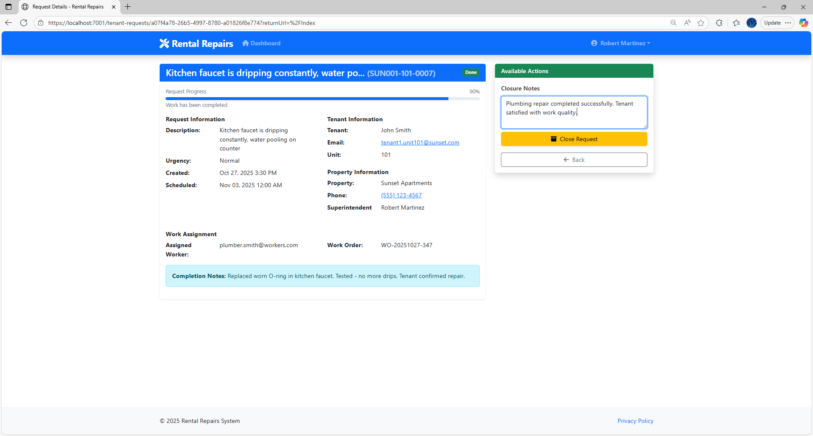
*Final closure of the maintenance request*

**Closure Details:**
- **Closure Notes**: "Plumbing repair completed successfully. Tenant satisfied with work quality."
- **Final Status**: ✅ Closed

### **4.3 Request Closed**
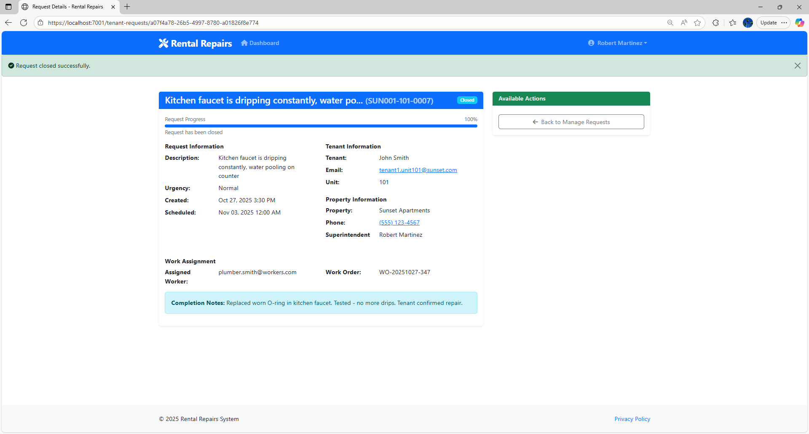
*Final confirmation that request lifecycle is complete*

**What Happens:**
- ✅ Request status: `Closed`
- ✅ Final notifications sent to all parties
- ✅ Performance metrics updated
- ✅ Request archived for reporting

---

## Final Dashboard Views

### **Tenant Final View**
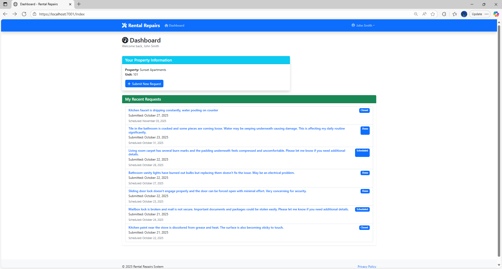
*Tenant sees completed request in their history*

### **Superintendent Summary**

*Superintendent dashboard updated with completed request metrics*

### **Worker Performance**

*Worker sees completed job added to their performance record*

---

## What This Demonstrates

### **Core Business Process**
- ✅ **Complete Request Lifecycle**: From creation to closure
- ✅ **Role-Based Access**: Each user sees relevant information
- ✅ **Status Tracking**: Real-time updates throughout process
- ✅ **Communication Flow**: Automated notifications at each step

### **Technical Features**
- ✅ **Clean Architecture**: Separation of concerns across layers
- ✅ **Domain-Driven Design**: Rich business logic in entities
- ✅ **CQRS Pattern**: Separate read/write operations
- ✅ **Event-Driven**: Notifications triggered by domain events

### **Business Rules Applied**
- ✅ **Worker Specialization**: Plumber assigned to plumbing issue
- ✅ **Availability Checking**: Worker schedule verified before assignment

---

## Key Takeaways

This simple workflow demonstrates:

1. **User Experience**: Clean, role-appropriate interfaces for each user type
2. **Business Logic**: Smart worker assignment based on skills and availability  
3. **Process Management**: Complete audit trail from request to closure
4. **Technical Excellence**: Modern .NET architecture with proper separation of concerns

**The application successfully handles the core maintenance management workflow while demonstrating advanced software architecture patterns and clean code principles.**

---

## Try It Yourself

1. **Clone Repository**: `git clone https://github.com/akhmelevtsov/RentalRepairs.CleanArchitecture`
2. **Run Application**: `dotnet run --project src/WebUI/`
3. **Open Browser**: `https://localhost:7001`
4. **Follow Workflow**: Use the credentials above to walk through each step

**Total Time**: ~10 minutes to complete full workflow